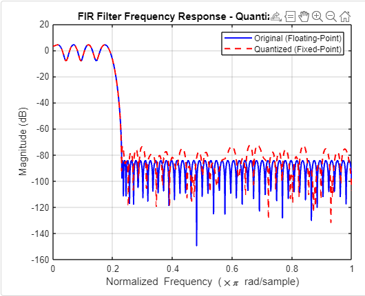
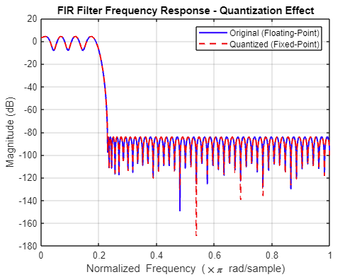
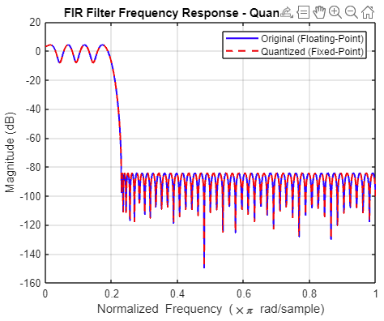
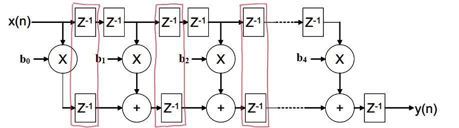
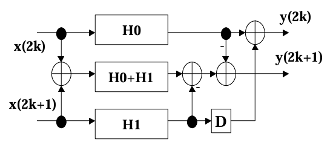
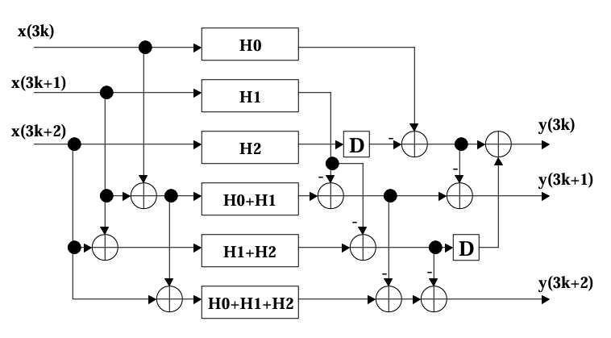
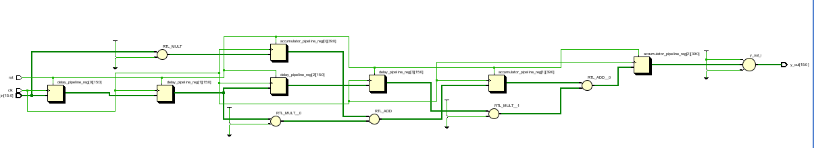
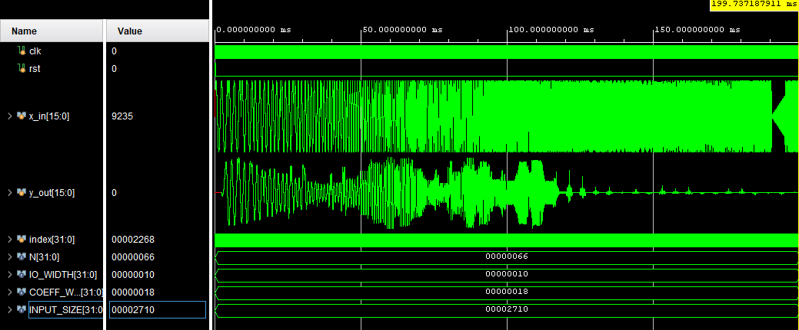
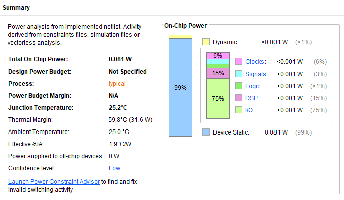

# FIR Filter Design

### by 

## Intro
This repository gives a walk through on the complete design process of a multi-tap low-pass FIR filter on an FPGA for audio processing purposes. Moving forward, the "multi-tap low-pass FIR filter" will be refered to as "filter." This report is divided into five sections:

0. [Necessary software and setup](#necessary-software-and-setup)
1. [Filter Coefficient and Frequency Design](#filter-coefficient-and-frequency-design)
2. [Filter Architecture Design](#filter-architecture-design)
    * Pipelined FIR
    * L2 Parallel FIR
    * L3 Parallel FIR
    * Pipelined, L3 Parallel FIR
3. [Filter Implementation and Testing](#filter-implementation-and-testing)
    * For each filter, performance, power, criticla path timing, and space/resource usage on FPGA will be analyzed
4. Comparison of all filters

> [!NOTE]  
> If you do not know what an FIR filter is or the principles of pipelining and paralelization in DSP design, I would recommend touching up on that first. Some links are provided in the [Resources](#resources) section.

## Report

### Necessary software and setup

### Filter Coefficient and Frequency Design

First, we will start by selecting the operating frequency for this FIR Filter. As we are only given a general transition region (0.2 $\pi$ to 0.23 $\pi$ rad/sample), I will assume that it is fair game to arbitrarly choose the sampling frequency for this. As such, this filter will be operating inside of an audio filtering device of CD quality (sampling rate = 44.1kHz). It will remove high frequencies in the range of 4.41 kHz to 5.07 kHz from this audio file; so things like high pitched whines or electric noise. 

> [!NOTE]  
> In design of the basic filter, the sampling frequency is not super important. It does not affect the coefficients for the filter itself assuming we preserve the same general transition region across all normalized frequencies. However, for implementing and testing the filter later, it will be important for determining the clock of the filter and generation of our test signal.

Moving forward, the next step is to compute the coefficients for the FIR filter. To do this, I developed a MATLAB script that uses Parks-McClellan algorithm to generate the filter coefficients. The following parameters were provided to the alogrithm:

* Number of Taps => 102
* Start Frequency (Normalized) => 0
* Passband Edge Frequency (Normalized) => 0.2
* Stopband Edge Frequency (Normalized) => 0.23
* End Frequency (Normalized) => 1
* Ampltiude Vector
    * Full attenuation from start to passband edge, no attenuation after stopband.
* Stopband Attenuation Weighting -> -80dB

Most parameters in this list are taken directly from the project description file. One element which I did change was the number of taps. In order to work with the parallelized filters later, I needed the nunber of taps to be a multiple of 2 and 3, but also greater than or equal to 100. 102 taps is the smallest count which fits these requirements.

From here, the built-in MATLAB function derives our filter coefficients. However, they are in floating point representation. For our implementation, we prefer fixed point representation as it is easier to perform integer math than floating point math on hardware. As such, we will convert to fixed point representation and then quantize the data. 

I used MATLAB's built in ```fi``` function to convert from floating point representatio to fixed point. When quantizing the data, I tried using 16-bit vs 32-bit signed representation. Below are my graphs showing the results of each:

<div align="center">
  
  <br>
  <p>Figure 1: 16-bit quantizied 102-tap filter</p>
</div>

<br>

<div align="center">
  
  <br>
  <p>Figure 2: 24-bit quantizied 102-tap filter</p>
</div>

<br>

<div align="center">
  
  <br>
  <p>Figure 3: 32-bit quantizied 102-tap filter</p>
</div>

<br>

The 16-bit representation is more space efficient and maintains the integrity of the signal before the stop band. However, after the stop band, there are extreme attenuations that sometimes have the signal go above -80dB. While the 32-bit representation will need more space and computing resources, it is more precise. The 24-bit representation gives the best of both worlds, and is within the range traditionally used for audio processing[^1]. While it has some attenutation differences after the stopband compared to the original model, all attenuations are kept bellow -80dB.

The filter coefficients are then stored into ```.mem``` files, with [decimal](fir_coeffs_decimal.mem) and [binary](fir_coeffs_binary.mem) representations. The mem files can later be loaded into the System Verilog code for the FIR filters.

### Filter Architecture Design

In this section, I will go over the high-level design for the four filters created.

#### Pipelined FIR
<div align="center">
  
  <br>
  <p>Figure 4: Vertically Pipelined FIR filter[^2] </p>
</div>

<br>

To design the pipelined filter, I simply added delay blocks onto each stage of the accumulator line of the filter. For future reference, I will call this vertical pipelining of the filter. This optimization reduced the critical path to the time of one addder plus time of one multiplier. For this to work, delay blocks must also be added onto the delay line, essentially doubing the delay of each step. 

An alternative solution is to pipeline between the adders and multipliers. For future reference, I will call this horizontal pipelining of the filter. However, given that the input and output are registers, this would make the critical path 102 (the number of taps) multiplied by the time for one adder. This is a lot worse of a critical path than the proposed solution above, assuming that a multiplication operation does not take much longer than an addition (i.e. 8ns vs 20ns).

I did experiment with combining both methods above, but ran into issues with combining horizontal direction and vertical direction pipelinig. In addition, this introduced extreme latency issues due to the number of delay blocks between ```x(n)``` and ```y(n)```. As such, I went with only vertical pipelining shown with red blocks in figure 4.

#### L2 Parallel FIR
<div align="center">
  
  <br>
  <p>Figure 5: 2-Parallel Reduced-Complexity Fast FIR filter[^3]</p>
</div>

<br>

To design the 2-Parallel Reduced-Complexity Fast filter, I followed the slides from Parhi's Chapter 9 lecture[^3], and took the design from there. This requires the generation of two sub filters, H0 and H1, with tap size of N/2, so 51 taps in our case. We split the coefficients up in an even-odd fashion (i.e. H0 = {h0, h2, h4, etc.} and H1 = {h1, h3, h5, etc.}). We generate the combined filter H0+H1 by combinging the coefficients at each index (i.e. H0+H1 = {h0+h1, h2+h3, h4+h5, etc.})/ Now that we have the sub filters, all that is needed is to copy the implementation provided by Parhi. Note that each "sub-filter" will be a non-pipelined filter.

#### L3 Parallel FIR
<div align="center">
  
  <br>
  <p>Figure 6: 3-Parallel Fast FIR filter[^3]</p>
</div>

<br>

Similar process to the 2-Parallel Reduced-Complexity Fast filter, but make three sub filters (H0, H1, H2) instead of taps N/3 => 34, and repeat the same process for combining and implementing.

#### Pipelined, L3 Parallel FIR

Similar process to the 3-Parallel Reduced-Complexity Fast filter, but use a pipelined filter within each "sub-filter."

### Filter Implementation and Testing

#### Implementation

All filter's were developed in AMD's Vivado software using System Verilog. ```.mem``` files are used to store coefficients, and to also store input data for testbench files. There are four folders above prefixed with "FIR," each of which contain implementation for the four filters mentioned in the previous section. Link to the system verilog files are listed below:

* Pipelined FIR [FIR_Pipelined]
    * Implementation: [fir_filter.sv](FIR_Pipelined\FIR_Pipelined.srcs\sources_1\new\fir_filter.sv)
    * Testbench: [fir_filter_tb.sv](FIR_Pipelined\FIR_Pipelined.srcs\sim_1\new\fir_filter_tb.sv)
    * RTL Schematic (reduced to 3 taps): 
* L2 Parallel FIR [FIR_L2]
    * Implementation:
    * Testbench: 
    * RTL Schematic (reduced to 6 taps): 
* L3 Parallel FIR [FIR_L3]
    * Implementation:
    * Testbench: 
    * RTL Schematic (reduced to 9 taps): 
* Pipelined, L3 Parallel FIR [FIR_Pipelined_L3]
    * Implementation:
    * Testbench: 
    * RTL Schematic (reduced to 9 taps): 

Each FIR filter processes a 16-bit input signal. The filter coefficients are 24-bit, as configured earlier. To maintain precision during filtering, each input sample is multiplied by a 24-bit coefficient, producing a 40-bit intermediate result (16-bit × 24-bit multiplication).

Since multiple taps contribute to the final output, these 40-bit products are accumulated in a 40-bit register. To ensure the output remains in a 16-bit format, a 24-bit right shift is applied to remove excess precision and scale the result appropriately. This final step helps mitigate quantization effects while preserving signal integrity.

#### Test Signal
For the testbenches to work, they require an input signal. This input signal is generated using the script [wave_gen.py](wave_gen.py). This script has a function ```sine_wave_sweep``` which takes in the following and generates a trajectory for a logarithmically increasing sine wave:

* File name
* Start frequency
* End frequency
* Number of Steps (for generating the number of frequencies in logspace)
* Samples per Frequency (for number of sample points per frequency in logspace)
* Clock cycle in ns

An input wave form sweeping 500Hz to 41.1kHz with 50 steps and 200 samples per frequencies is provided in the [input.mem](input.mem) file. 

> [!NOTE]  
> This file is intended to work with filters sampling at 44.1 kHz. If you are using a different sampling rate, you will need to produce a new file using the linked python script.

#### Testing criteria (and how to derive)
Four criteria will be tested for:
* Behavioral Simulation
    * How does the filter respond to the input signal?
* Timing
    * What is critical path of the filter?
    * What is influecning the critical path?
* Power
    * How many watts does the filter consume?
    * What is the distribution of power consumption among components?
* Area / Resource Utilization
    * How many resources on the FPGA are used?
    * Rough conversion to area using this equation: $A_{\text{FPGA}} \approx (1 \times U_{\text{LUT}}) + (0.5 \times U_{\text{FF}}) + (5 \times U_{\text{DSP}}) + (2 \times U_{\text{IO}})$ with the following weights (arbitrarly chosen by ChatGPT): 

    * | Resource | Weight |
      |----------|-------:|
      | LUTs     | 1      |
      | FFs      | 0.5    |
      | DSPs     | 5      |
      | IOs      | 2      |

#### Pipelined FIR Filter Results

##### Behavioral Sim

<div align="center">
  
  <br>
  <p>Figure 11: Pipelined FIR Filter Behavioral Sim</p>
</div>

<br>

It is evident that the filter is operating as intended. In the beginning, we can see the three large pulses before the pass band, and then quickly after that we get attenuated response from the filter given the input signal. As the input file is from logarithmic scale, the testing output looks compressed towards the right side compared to the linear scaled MATLAB graphs from the beginning. 

There is a pretty significant delay of about 204 clock cycles before the filter starts outputing data. This is due to the doubly pipelined delay line. Thus, latency with this solution is pretty high.

##### Timing


##### Power

<div align="center">
  
  <br>
  <p>Figure 13: Pipelined FIR Filter Power</p>
</div>

<br>

The total on-chip power shown is about 0.081 Watts, which is very good. Diging deeper it is clear that most power is consumed from device statics. After that, device I/O takes up the most power. Other components which are integral to the algorithm itself do not take up that much power in comparison to the I/O and statics. Choosing to go with only a 16-bit input and 24-bit coefficient size has definitely helped to save on power consumption; which will also hold true for the other implementations.

##### Area / Resource Utilization

#### L2 Parallel FIR Filter Results
#### L3 Parallel FIR Filter Results
#### Pipelined, L3 Parallel FIR Filter Results

## Resources

### Sources:
[^1]: D. Zaucha, “How many bits do you need? A discussion of precision for digital audio filters*,” EE Times, [https://www.eetimes.com/how-many-bits-do-you-need-a-discussion-of-precision-for-digital-audio-filters/](https://www.eetimes.com/how-many-bits-do-you-need-a-discussion-of-precision-for-digital-audio-filters/) (accessed Mar. 18, 2025). 

[^2]: S. Arar, “Pipelined direct form FIR versus the transposed structure - technical articles,” All About Circuits, [https://www.allaboutcircuits.com/technical-articles/pipelined-direct-form-fir-versus-the-transposed-structure/](https://www.allaboutcircuits.com/technical-articles/pipelined-direct-form-fir-versus-the-transposed-structure/) (accessed Mar. 18, 2025). 

[^3]: K. Parhi, "Chapter 9: Algorithmic Strength Reduction in Filters and Transforms," [https://people.ece.umn.edu/users/parhi/SLIDES/chap9.pdf](https://people.ece.umn.edu/users/parhi/SLIDES/chap9.pdf) (accessed Mar. 18, 2025). 

### Textbook:

### Youtube Videos: